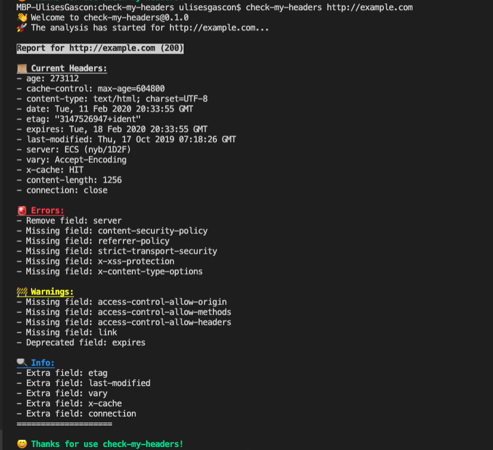

<p align="center"><h1 align="center">
  check-my-headers
</h1>

<p align="center">
  Fast and simple way to check any HTTP Headers
</p>

<p align="center">
  <a href="https://www.npmjs.org/package/check-my-headers"></a>
  <a href="https://www.npmjs.org/package/check-my-headers"></a>
  <a href="https://www.npmjs.org/package/check-my-headers"></a>
  <a href="https://codecov.io/gh/ulisesgascon/check-my-headers"></a>
  <a href="https://snyk.io/test/github/ulisesgascon/check-my-headers"></a>
</p>


<p align="center">
  
</p>

<p align="center">
  Thanks <a href="https://github.com/lirantal">Liran Tal</a> and the amazing <a href="https://snyk.io">Snyk team</a> for your support 😊
</p>

</p>


# About

Fast and simple way to check any HTTP Headers

# Usage

## Command line

Using Node.js's `npx` to run a one-off scan of a website:

```bash
npx check-my-headers https://example.com 
```

The CLI will gracefully handle cases where the URL to scan is missing or wrong:

```bash
$ npx check-my-headers
👋  Welcome to check-my-headers@0.1.0
😬  Missing argument URL!
👉  Example: check-my-headers https://github.com/ulisesgascon/check-my-headers
```

## Docker

To build and run the container locally:

```bash
# Clone Repo:
git clone https://github.com/ulisesgascon/check-my-headers.git

# Change to repo's cloned directory:
cd check-my-headers

# Build Image locally:
docker build --no-cache -t ulisesgascon/check-my-headers:latest .

# Run container:
docker run --rm -e SCAN_URL="https://www.github.com/" ulisesgascon/check-my-headers:latest
```

`SCAN_URL` is an environment variable and its value must be replaced with the desired URL during Docker run. Docker container will exit once the scan has been completed.


# Install

You can install globally via:

```bash
npm install -g check-my-headers
```


# Test

You can run them:

```bash
npm run test:coverage
```

# Contributing

Please consult [CONTRIBUTING](./CONTRIBUTING.md) for guidelines on contributing to this project.

# Author

**check-my-headers** © [Ulises Gascón](https://github.com/ulisesgascon), Released under the [MIT](./LICENSE) License.
